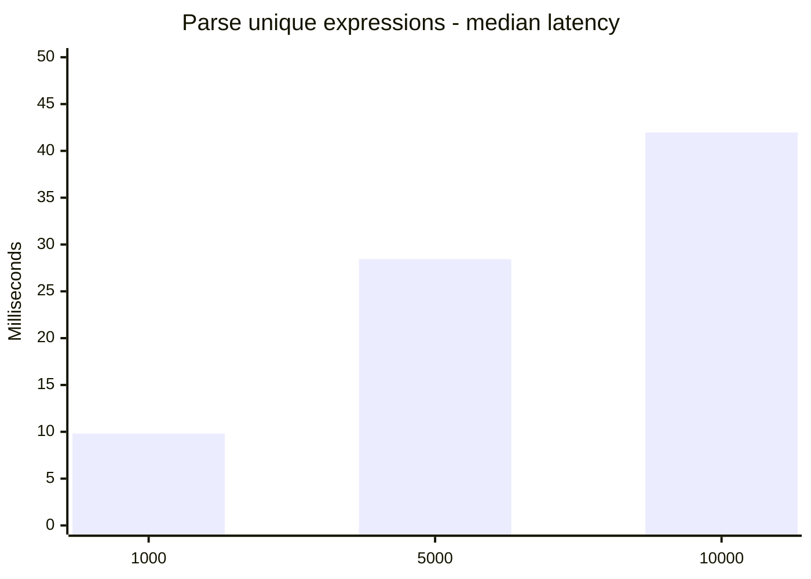
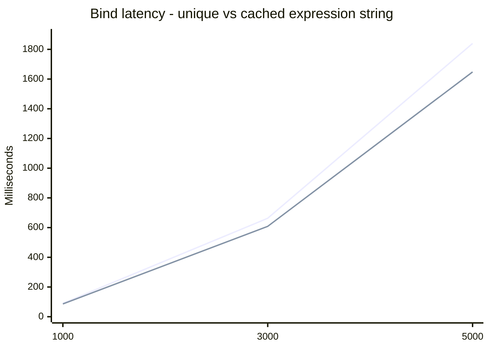
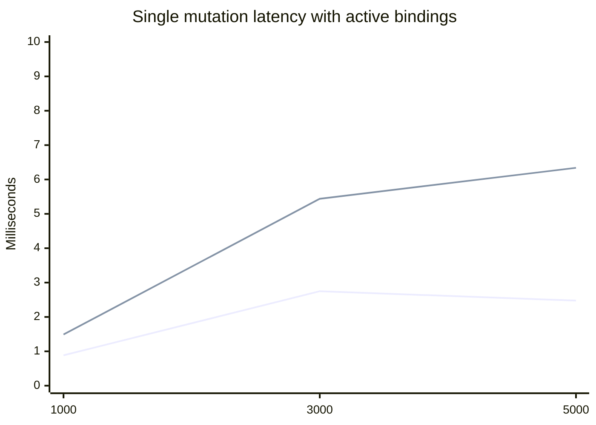
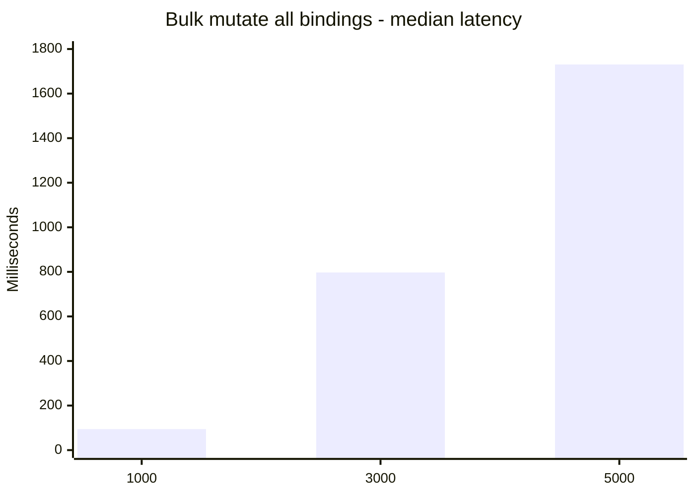

# RS-X SPA Readiness Benchmark Report

Date: 2026-03-14  
Package: `@rs-x/expression-parser`  
Question: Is rs-x fast enough to back a high-performance SPA framework layer (for example Angular)?

## Executive summary

- Yes, for realistic UI mutation patterns (small localized updates), rs-x is fast enough to be a solid reactive core.
- Parse cost is not the main bottleneck in this benchmark. Initial binding and large bulk updates dominate.
- At 5,000 active bindings, one localized model mutation completed in `2.476 ms` median (`6.339 ms` p95).
- Bulk mutating all 5,000 bindings in one wave is expensive (`1730.699 ms` median), so architecture should favor fine-grained updates over full-screen invalidations.

## Environment and method

- Node: `v25.4.0`
- Platform: `darwin` `arm64`
- Benchmark runner:
  - [benchmark-spa-readiness.mjs](/Users/robertsanders/projects/rs-x/rs-x-expression-parser/scripts/benchmark-spa-readiness.mjs)
- Raw data:
  - [benchmark-2026-03-14.json](/Users/robertsanders/projects/rs-x/reports/rsx-spa-performance/benchmark-2026-03-14.json)

Measured scenarios:

1. Parse unique expression strings.
2. Bind expressions (`create + initial evaluate`) for:
   - unique expression per binding
   - cached expression string (`'a + b'`)
3. Update throughput with bindings kept alive:
   - single localized mutation
   - bulk mutation of all bound models

## Results

### Parse median latency (lower is better)



| Bindings / parses | Median ms | p95 ms | Ops/s (median) |
| --- | ---: | ---: | ---: |
| 1,000 | 9.808 | 10.276 | 101,954 |
| 5,000 | 28.445 | 30.040 | 175,775 |
| 10,000 | 41.971 | 44.947 | 238,259 |

### Bind median latency (create + initial evaluate)



| Scenario | Count | Median ms | p95 ms | us/op |
| --- | ---: | ---: | ---: | ---: |
| Unique expression per binding | 1,000 | 90.311 | 92.195 | 90.311 |
| Unique expression per binding | 3,000 | 662.941 | 664.012 | 220.980 |
| Unique expression per binding | 5,000 | 1839.835 | 1845.994 | 367.967 |
| Cached expression string (`a + b`) | 1,000 | 86.051 | 87.786 | 86.051 |
| Cached expression string (`a + b`) | 3,000 | 608.480 | 628.957 | 202.827 |
| Cached expression string (`a + b`) | 5,000 | 1647.797 | 1690.970 | 329.559 |

### Localized single mutation latency with many active bindings



Legend:
- line 1 = median
- line 2 = p95

| Active bindings | Median ms | p95 ms | Mutations per 16.67ms frame (median) |
| --- | ---: | ---: | ---: |
| 1,000 | 0.884 | 1.489 | 18.85 |
| 3,000 | 2.749 | 5.439 | 6.06 |
| 5,000 | 2.476 | 6.339 | 6.73 |

### Bulk mutation of all bound models (stress case)



| Bulk mutation count | Median ms | p95 ms | us/op |
| --- | ---: | ---: | ---: |
| 1,000 | 94.355 | 96.657 | 94.355 |
| 3,000 | 797.324 | 802.698 | 265.775 |
| 5,000 | 1730.699 | 1816.252 | 346.140 |

## Interpretation for SPA framework use

- Good fit for framework integration:
  - Typical UI updates are localized. In that shape, rs-x update cost remains in low milliseconds even with thousands of active bindings.
- Main performance risks:
  - Mounting very large binding sets at once.
  - Broad invalidations that mutate many tracked nodes in one tick.
- Practical architecture guidance:
  - Reuse expression strings where possible (cache hit path).
  - Avoid global “update everything” writes.
  - Use list virtualization/chunked mount for very large trees.
  - Keep each screen/route to a reasonable active-binding budget and lazy-load deeper sections.

## Reproduce

From repo root:

```bash
pnpm -C rs-x-expression-parser run bench:spa-readiness
```

This writes a timestamped JSON file in:

`reports/rsx-spa-performance/benchmark-YYYY-MM-DD.json`
