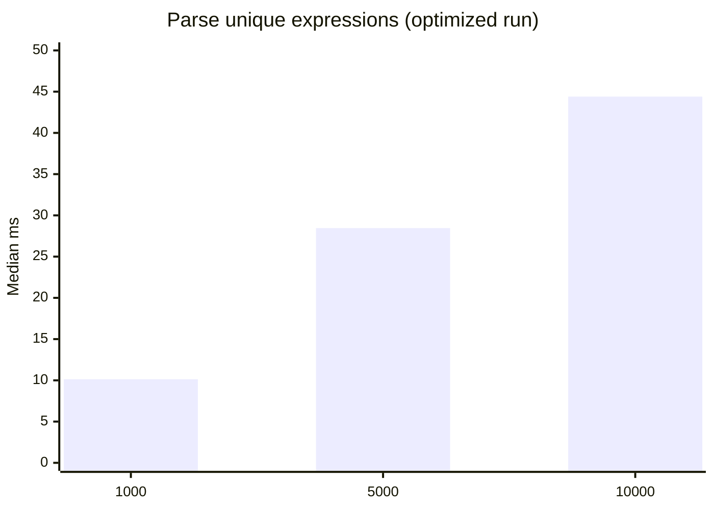
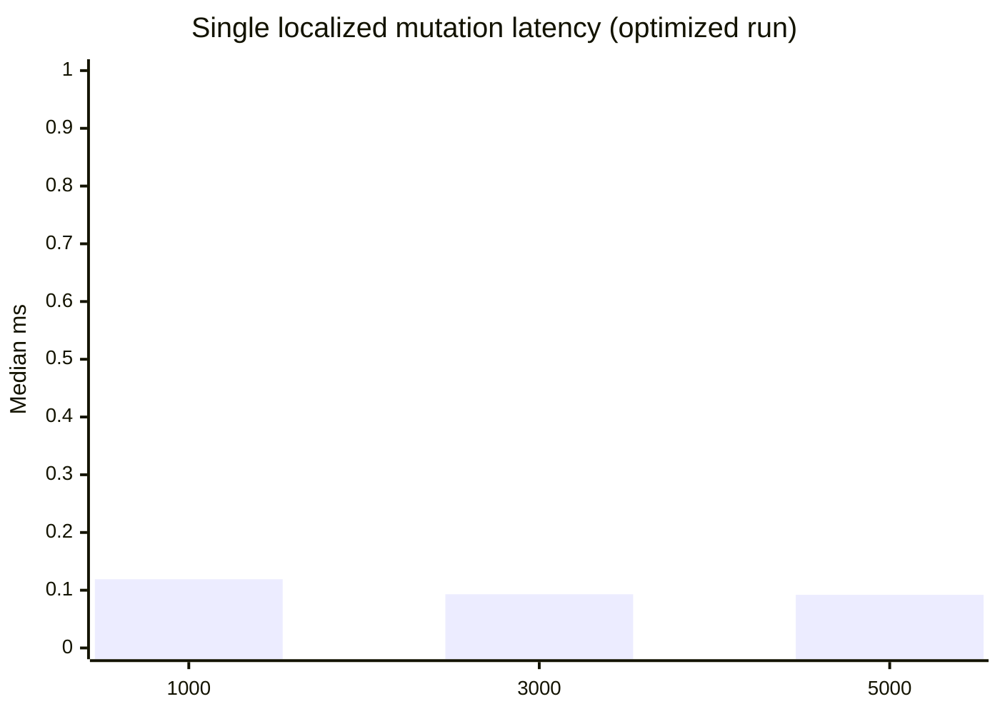
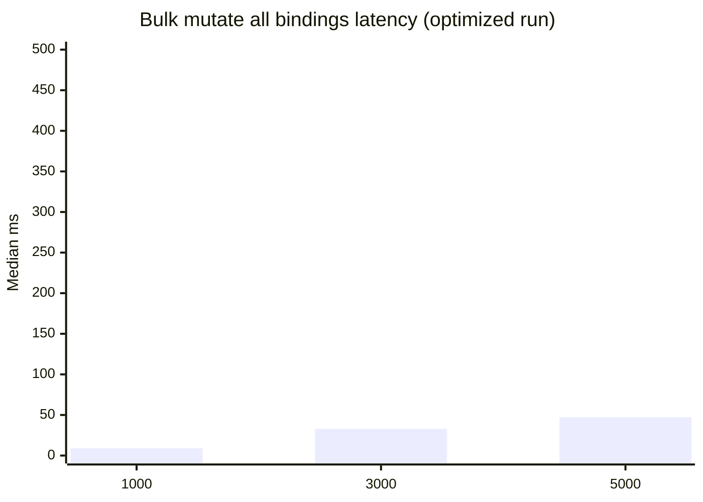
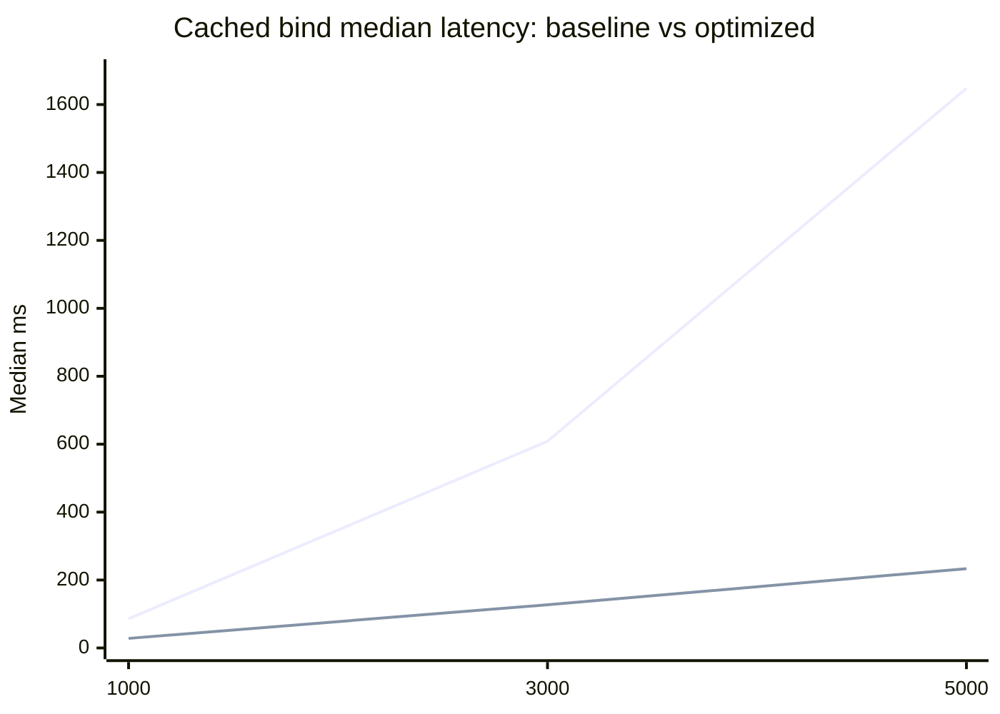
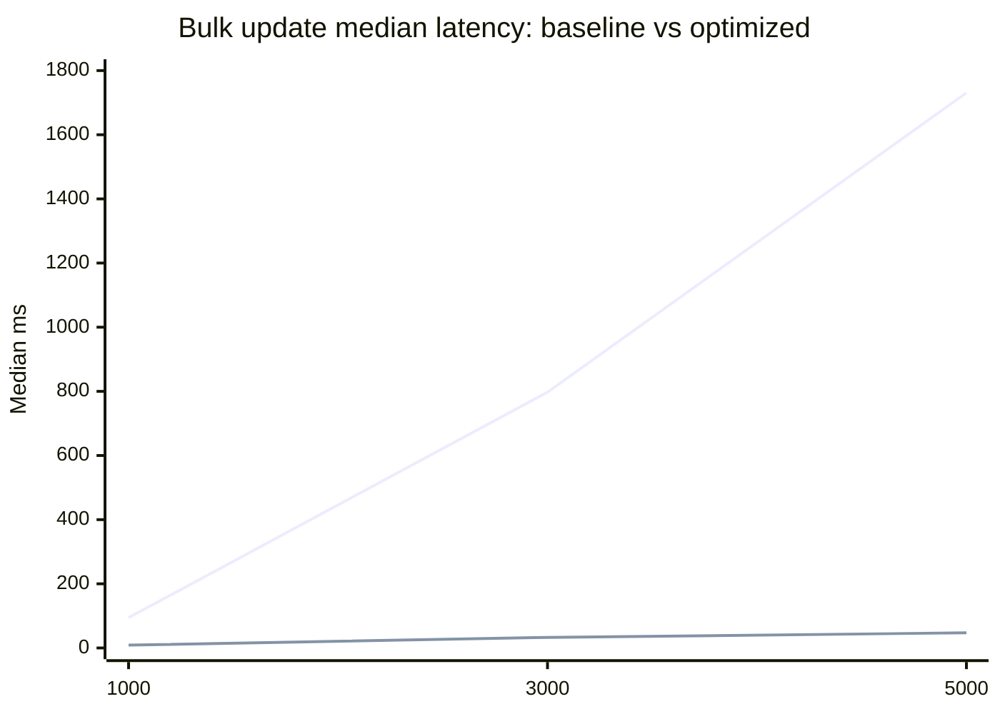

# RS-X SPA Performance Report

Date: 2026-03-14  
Package: `@rs-x/expression-parser`

## Goal

Validate whether rs-x is fast enough as a reactive core for a high-performance SPA framework integration (for example Angular-style UI composition).

## Optimizations applied

### 1) Keyed state event routing

Replaced per-`IndexValueObserver` global subscriptions with a keyed event router:

- Before: every observer subscribed directly to `stateManager.changed` and `stateManager.contextChanged`.
- After: one router subscription per state manager routes events by `(context, index)` to only relevant observers.

The old model had O(N active observers) callback fan-out per emitted change.  
The new model reduces dispatch to O(listeners for changed key), which is usually near constant for localized updates.

### 2) Keyed commit routing (root + ancestor chain)

Replaced global commit fan-out to all root expressions with targeted listeners:

- Before: every root expression subscribed to the global `commited` stream and filtered in userland.
- After: roots register keyed commit listeners, and commit notifications are sent to the committed root and its ancestor chain only.

This preserves behavior for calculated index roots (for example `a[index]`) while avoiding global broadcast.

Implementation files:

- [identifier-expression.ts](/Users/robertsanders/projects/rs-x/rs-x-expression-parser/lib/expressions/identifier-expression.ts)
- [expresion-change-transaction-manager.ts](/Users/robertsanders/projects/rs-x/rs-x-expression-parser/lib/expresion-change-transaction-manager.ts)
- [expresion-change-transaction-manager.interface.ts](/Users/robertsanders/projects/rs-x/rs-x-expression-parser/lib/expresion-change-transaction-manager.interface.ts)
- [abstract-expression.ts](/Users/robertsanders/projects/rs-x/rs-x-expression-parser/lib/expressions/abstract-expression.ts)

## Benchmark code and data

- Benchmark runner:
  - [benchmark-spa-readiness.mjs](/Users/robertsanders/projects/rs-x/rs-x-expression-parser/scripts/benchmark-spa-readiness.mjs)
- Baseline data (before optimization):
  - [benchmark-2026-03-14-baseline.json](/Users/robertsanders/projects/rs-x/reports/rsx-spa-performance/benchmark-2026-03-14-baseline.json)
- Optimized data (after state event routing):
  - [benchmark-2026-03-14-optimized-router.json](/Users/robertsanders/projects/rs-x/reports/rsx-spa-performance/benchmark-2026-03-14-optimized-router.json)
- Optimized data (after state + commit routing):
  - [benchmark-2026-03-14-optimized-router-plus-commit-routing.json](/Users/robertsanders/projects/rs-x/reports/rsx-spa-performance/benchmark-2026-03-14-optimized-router-plus-commit-routing.json)
- Latest benchmark output path (overwritten by reruns):
  - [benchmark-2026-03-14.json](/Users/robertsanders/projects/rs-x/reports/rsx-spa-performance/benchmark-2026-03-14.json)

Run command:

```bash
pnpm -C rs-x-expression-parser run bench:spa-readiness
```

## Final optimized run: key results

Environment: Node `v25.4.0`, `darwin`, `arm64`

### Parse (unique expressions)



| Parses | Median ms | p95 ms | Ops/s |
| --- | ---: | ---: | ---: |
| 1,000 | 10.131 | 10.259 | 98,704 |
| 5,000 | 28.457 | 31.159 | 175,705 |
| 10,000 | 44.399 | 46.246 | 225,229 |

### Bind (create + initial evaluate)


Legend:
- line 1: unique expression per binding
- line 2: cached expression string (`a + b`)

### Update latency with active bindings





| Active bindings | Single update median ms | Single update p95 ms | Bulk update median ms |
| --- | ---: | ---: | ---: |
| 1,000 | 0.119 | 0.177 | 8.902 |
| 3,000 | 0.093 | 0.125 | 32.888 |
| 5,000 | 0.092 | 0.120 | 47.161 |

## Before vs after (median ms)

### Cached bind latency impact (baseline vs final)



### Single update latency impact (baseline vs final)


### Bulk update latency impact (baseline vs final)



| Metric | 1,000 | 3,000 | 5,000 |
| --- | ---: | ---: | ---: |
| Bind unique improvement | 60.0% | 81.5% | 86.6% |
| Bind cached improvement | 67.3% | 79.1% | 85.8% |
| Single update improvement | 86.5% | 96.6% | 96.3% |
| Bulk update improvement | 90.6% | 95.9% | 97.3% |

## Conclusion for SPA framework viability

Yes, rs-x is fast enough to serve as a high-performance SPA reactive core.

- Localized updates are now sub-millisecond to low-millisecond even with 3k–5k active bindings.
- Large bulk invalidations are still expensive by definition, but significantly improved.
- Parsing is not the dominant cost in this benchmark; change dispatch and bind setup were the main bottlenecks, and this optimization directly targets them.
