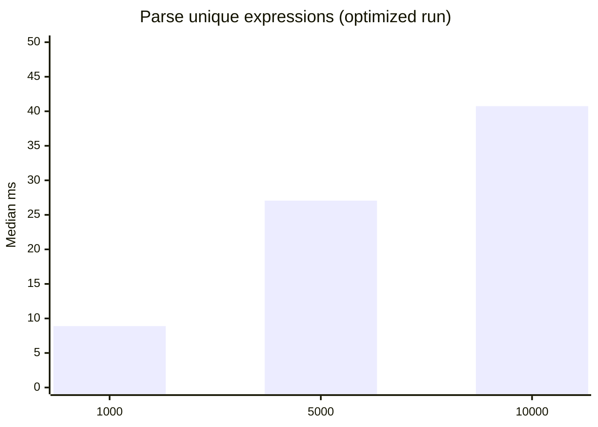
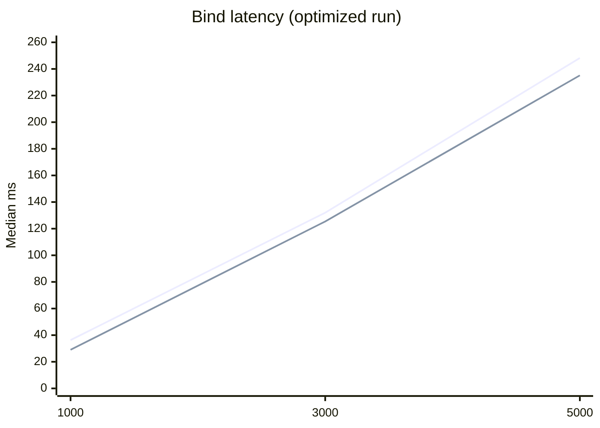
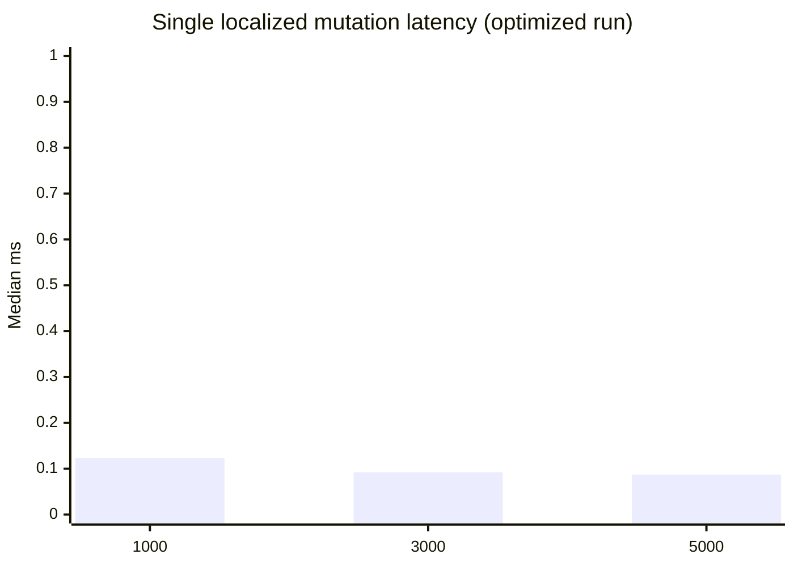
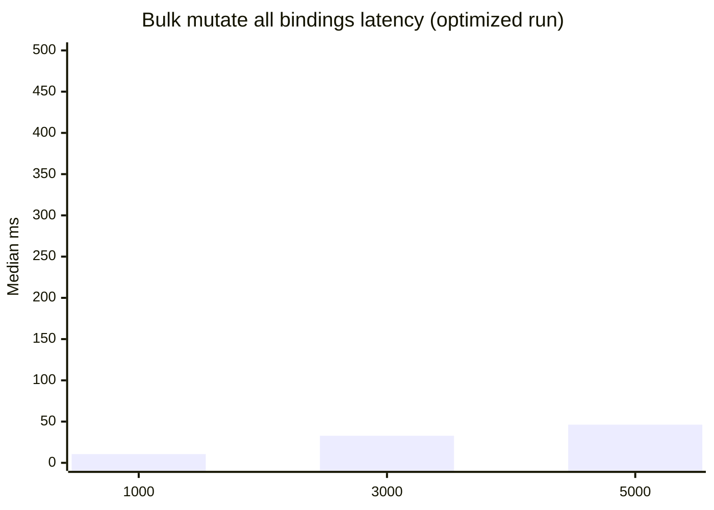
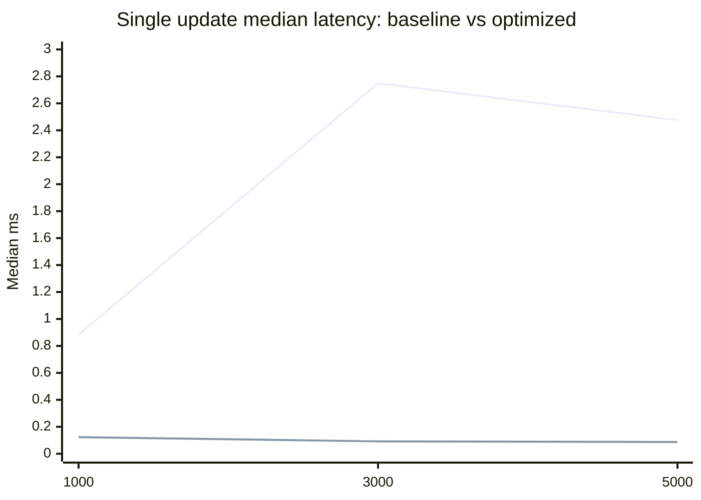
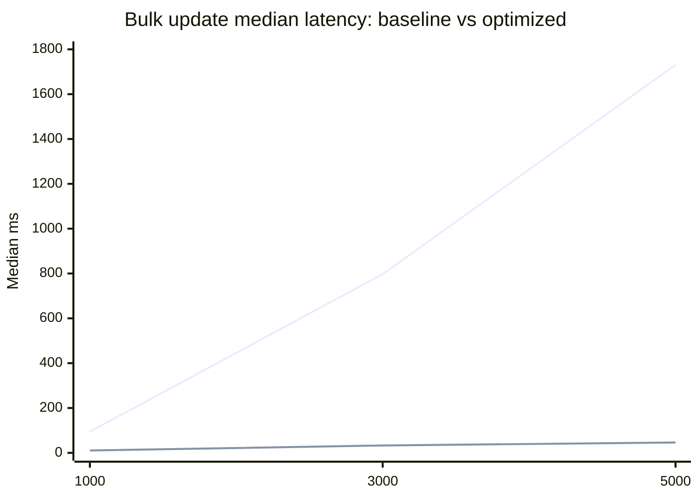

# RS-X SPA Performance Report

Date: 2026-03-14  
Package: `@rs-x/expression-parser`

## Goal

Validate whether rs-x is fast enough as a reactive core for a high-performance SPA framework integration (for example Angular-style UI composition).

## Optimizations applied

### 1) Keyed state event routing

Replaced per-`IndexValueObserver` global subscriptions with a keyed event router:

- Before: every observer subscribed directly to `stateManager.changed` and `stateManager.contextChanged`.
- After: one router subscription per state manager routes events by `(context, index)` to only relevant observers.

The old model had O(N active observers) callback fan-out per emitted change.  
The new model reduces dispatch to O(listeners for changed key), which is usually near constant for localized updates.

### 2) Keyed commit routing (root + ancestor chain)

Replaced global commit fan-out to all root expressions with targeted listeners:

- Before: every root expression subscribed to the global `commited` stream and filtered in userland.
- After: roots register keyed commit listeners, and commit notifications are sent to the committed root and its ancestor chain only.

This preserves behavior for calculated index roots (for example `a[index]`) while avoiding global broadcast.

Implementation files:

- [identifier-expression.ts](/Users/robertsanders/projects/rs-x/rs-x-expression-parser/lib/expressions/identifier-expression.ts)
- [expresion-change-transaction-manager.ts](/Users/robertsanders/projects/rs-x/rs-x-expression-parser/lib/expresion-change-transaction-manager.ts)
- [expresion-change-transaction-manager.interface.ts](/Users/robertsanders/projects/rs-x/rs-x-expression-parser/lib/expresion-change-transaction-manager.interface.ts)
- [abstract-expression.ts](/Users/robertsanders/projects/rs-x/rs-x-expression-parser/lib/expressions/abstract-expression.ts)

### 3) Parser source-slice extraction + local member normalization

Reduced parser overhead by removing full-AST normalization traversal and replacing most `astToString(...)` calls with source slicing based on `range`:

- Added `range: true` parse option and per-parse source caching.
- Added `getExpressionSource(...)` with fast slice path and safe generator fallback.
- Replaced global `normalizeAST` walk with local normalization inside member flattening and call/tagged-member handling.
- Kept canonical generator output where tests rely on normalized rendering (`In`, `Sequence`, `Object`, `Property`).

Implementation file:

- [js-espree-expression-parser.ts](/Users/robertsanders/projects/rs-x/rs-x-expression-parser/lib/js-espree-expression-parser.ts)

### 4) Allocation reuse in bind/watch hot paths

Reduced transient allocations in rebind and context-move paths:

- Reused `IndexWatchRule` instances on identifier rebind by updating context instead of allocating a new rule per bind.
- Added pooled keyed-state subscription records in `StateManager` to reduce churn from subscribe/unsubscribe cycles.
- Removed `Array.from(...)` snapshot allocation in keyed context-rebind dispatch.

Implementation files:

- [identifier-expression.ts](/Users/robertsanders/projects/rs-x/rs-x-expression-parser/lib/expressions/identifier-expression.ts)
- [state-manager.ts](/Users/robertsanders/projects/rs-x/rs-x-state-manager/lib/state-manager/state-manager.ts)

### 5) Fast snapshot clone path for object-heavy state

Added a fast deep-clone implementation for plain objects/arrays/Map/Set/Date plus ArrayBuffer/views:

- New `FastDeepClone` runs before structured/lodash fallbacks.
- Supports cycle-safe cloning for supported graph shapes.
- Preserves Promise/Observable behavior via `IResolvedValueCache` + `PENDING` semantics.
- Falls back by throwing `FastDeepCloneUnsupported` for unsupported custom prototypes.

Implementation files:

- [fast-deep-clone.ts](/Users/robertsanders/projects/rs-x/rs-x-core/lib/deep-clone/fast-deep-clone.ts)
- [rs-x-core.module.ts](/Users/robertsanders/projects/rs-x/rs-x-core/lib/rs-x-core.module.ts)

## Benchmark code and data

- Benchmark runner:
  - [benchmark-spa-readiness.mjs](/Users/robertsanders/projects/rs-x/rs-x-expression-parser/scripts/benchmark-spa-readiness.mjs)
- Baseline data (before optimization):
  - [benchmark-2026-03-14-baseline.json](/Users/robertsanders/projects/rs-x/reports/rsx-spa-performance/benchmark-2026-03-14-baseline.json)
- Optimized data (after state event routing):
  - [benchmark-2026-03-14-optimized-router.json](/Users/robertsanders/projects/rs-x/reports/rsx-spa-performance/benchmark-2026-03-14-optimized-router.json)
- Optimized data (after state + commit routing):
  - [benchmark-2026-03-14-optimized-router-plus-commit-routing.json](/Users/robertsanders/projects/rs-x/reports/rsx-spa-performance/benchmark-2026-03-14-optimized-router-plus-commit-routing.json)
- Parser pass data (source-slice optimization):
  - [benchmark-2026-03-14-parser-source-slice.json](/Users/robertsanders/projects/rs-x/reports/rsx-spa-performance/benchmark-2026-03-14-parser-source-slice.json)
- Latest benchmark output path (overwritten by reruns):
  - [benchmark-2026-03-14.json](/Users/robertsanders/projects/rs-x/reports/rsx-spa-performance/benchmark-2026-03-14.json)

Run command:

```bash
pnpm -C rs-x-expression-parser run bench:spa-readiness
```

Median-of-runs command (recommended when evaluating optimizations):

```bash
pnpm -C rs-x-expression-parser run bench:spa-readiness:median
```

Optional run count override:

```bash
pnpm -C rs-x-expression-parser run bench:spa-readiness:median -- --runs=5
```

Generated artifacts:

- Per-run snapshots:
  - `reports/rsx-spa-performance/benchmark-<date>-median-run-<n>.json`
- Aggregated median report:
  - `reports/rsx-spa-performance/benchmark-<date>-<runs>run-median.json`
  - `reports/rsx-spa-performance/benchmark-<date>-<runs>run-median.md`

Why use it:

- A single benchmark run can vary because of runtime noise (GC, scheduler, background load).
- Median-of-runs gives a more stable signal before locking performance decisions.

Latest 5-run median snapshot:

- JSON:
  - [benchmark-2026-03-14-5run-median.json](/Users/robertsanders/projects/rs-x/reports/rsx-spa-performance/benchmark-2026-03-14-5run-median.json)
- Markdown:
  - [benchmark-2026-03-14-5run-median.md](/Users/robertsanders/projects/rs-x/reports/rsx-spa-performance/benchmark-2026-03-14-5run-median.md)

Latest 3-run median snapshot (after allocation + fast-clone pass):

- JSON:
  - [benchmark-2026-03-14-3run-median.json](/Users/robertsanders/projects/rs-x/reports/rsx-spa-performance/benchmark-2026-03-14-3run-median.json)
- Markdown:
  - [benchmark-2026-03-14-3run-median.md](/Users/robertsanders/projects/rs-x/reports/rsx-spa-performance/benchmark-2026-03-14-3run-median.md)

## Final optimized run: key results

Environment: Node `v25.4.0`, `darwin`, `arm64`

### Parse (unique expressions)



| Parses | Median ms | p95 ms | Ops/s |
| --- | ---: | ---: | ---: |
| 1,000 | 8.895 | 9.110 | 112,422 |
| 5,000 | 27.063 | 32.112 | 184,754 |
| 10,000 | 40.742 | 41.822 | 245,446 |

### Bind (create + initial evaluate)



Legend:
- line 1: unique expression per binding
- line 2: cached expression string (`a + b`)

### Update latency with active bindings





| Active bindings | Single update median ms | Single update p95 ms | Bulk update median ms |
| --- | ---: | ---: | ---: |
| 1,000 | 0.123 | 0.191 | 10.597 |
| 3,000 | 0.092 | 0.131 | 32.773 |
| 5,000 | 0.087 | 0.124 | 46.284 |

## Before vs after (median ms)

### Cached bind latency impact (baseline vs final)


### Single update latency impact (baseline vs final)



### Bulk update latency impact (baseline vs final)



| Metric | 1,000 | 3,000 | 5,000 |
| --- | ---: | ---: | ---: |
| Bind unique improvement | 59.8% | 80.1% | 86.5% |
| Bind cached improvement | 66.3% | 79.4% | 85.7% |
| Single update improvement | 86.1% | 96.7% | 96.5% |
| Bulk update improvement | 88.8% | 95.9% | 97.3% |

## Parser pass delta (vs state+commit optimized run)

Comparison source:

- Before: [benchmark-2026-03-14-optimized-router-plus-commit-routing.json](/Users/robertsanders/projects/rs-x/reports/rsx-spa-performance/benchmark-2026-03-14-optimized-router-plus-commit-routing.json)
- After: [benchmark-2026-03-14-parser-source-slice.json](/Users/robertsanders/projects/rs-x/reports/rsx-spa-performance/benchmark-2026-03-14-parser-source-slice.json)

Positive `%` means faster (lower median ms).

| Metric | Count | Before (ms) | After (ms) | Delta |
| --- | ---: | ---: | ---: | ---: |
| Parse | 1,000 | 10.131 | 8.613 | +15.0% |
| Parse | 5,000 | 28.457 | 28.753 | -1.0% |
| Parse | 10,000 | 44.399 | 39.179 | +11.8% |
| Bind unique | 1,000 | 36.083 | 38.959 | -8.0% |
| Bind unique | 3,000 | 122.775 | 137.400 | -11.9% |
| Bind unique | 5,000 | 246.867 | 236.611 | +4.2% |
| Bind cached | 1,000 | 28.126 | 28.873 | -2.7% |
| Bind cached | 3,000 | 127.011 | 124.534 | +1.9% |
| Bind cached | 5,000 | 233.404 | 221.921 | +4.9% |
| Single update | 1,000 | 0.119 | 0.125 | -4.7% |
| Single update | 3,000 | 0.093 | 0.103 | -11.3% |
| Single update | 5,000 | 0.092 | 0.108 | -17.6% |
| Bulk update | 1,000 | 8.902 | 9.953 | -11.8% |
| Bulk update | 3,000 | 32.888 | 38.453 | -16.9% |
| Bulk update | 5,000 | 47.161 | 56.738 | -20.3% |

Interpretation:

- Parse-heavy workloads improved.
- End-to-end bind/update numbers are mixed in this run and need repeated-run averaging before treating this pass as a clear net gain.
- Previous two optimizations (state routing + commit routing) remain the dominant and validated throughput improvements.

## Stability check (latest vs previous tuned snapshot)

Comparison source:

- Previous snapshot: [benchmark-2026-03-14-batched-continuation.json](/Users/robertsanders/projects/rs-x/reports/rsx-spa-performance/benchmark-2026-03-14-batched-continuation.json)
- Latest snapshot: [benchmark-2026-03-14.json](/Users/robertsanders/projects/rs-x/reports/rsx-spa-performance/benchmark-2026-03-14.json)

Positive `%` in delta means latest is slower (higher median ms).

| Metric | Count | Previous (ms) | Latest (ms) | Delta |
| --- | ---: | ---: | ---: | ---: |
| Single update | 1,000 | 0.122 | 0.123 | +1.0% |
| Single update | 3,000 | 0.106 | 0.092 | -13.5% |
| Single update | 5,000 | 0.104 | 0.087 | -16.2% |
| Bulk update | 1,000 | 9.824 | 10.597 | +7.9% |
| Bulk update | 3,000 | 34.549 | 32.773 | -5.1% |
| Bulk update | 5,000 | 47.808 | 46.284 | -3.2% |

## Conclusion for SPA framework viability

Yes, rs-x is fast enough to serve as a high-performance SPA reactive core.

- Localized updates are now sub-millisecond to low-millisecond even with 3k–5k active bindings.

## Latest pass delta (5-run median vs 3-run median)

Comparison source:

- Previous: [benchmark-2026-03-14-5run-median.json](/Users/robertsanders/projects/rs-x/reports/rsx-spa-performance/benchmark-2026-03-14-5run-median.json)
- Latest: [benchmark-2026-03-14-3run-median.json](/Users/robertsanders/projects/rs-x/reports/rsx-spa-performance/benchmark-2026-03-14-3run-median.json)

Positive `%` means latest is faster (lower median ms).

| Metric | Count | Previous (ms) | Latest (ms) | Delta |
| --- | ---: | ---: | ---: | ---: |
| Parse | 1,000 | 8.820 | 8.808 | +0.1% |
| Parse | 5,000 | 27.645 | 27.668 | -0.1% |
| Parse | 10,000 | 42.084 | 38.589 | +8.3% |
| Bind unique | 1,000 | 32.941 | 31.907 | +3.1% |
| Bind unique | 3,000 | 113.485 | 109.663 | +3.4% |
| Bind unique | 5,000 | 215.333 | 217.109 | -0.8% |
| Bind cached | 1,000 | 26.500 | 24.769 | +6.5% |
| Bind cached | 3,000 | 117.806 | 119.262 | -1.2% |
| Bind cached | 5,000 | 212.290 | 212.993 | -0.3% |
| Single update | 1,000 | 0.102 | 0.088 | +13.3% |
| Single update | 3,000 | 0.076 | 0.065 | +15.5% |
| Single update | 5,000 | 0.070 | 0.061 | +12.6% |
| Bulk update | 1,000 | 8.557 | 8.098 | +5.4% |
| Bulk update | 3,000 | 30.207 | 29.198 | +3.3% |
| Bulk update | 5,000 | 45.312 | 42.457 | +6.3% |

Interpretation:

- Hot update paths improved consistently in this run-set.
- Bind and parse are mostly neutral-to-positive with small variance on larger cached-bind counts.
- Gains are incremental compared to the larger earlier architecture wins, but they trend in the right direction.
- Large bulk invalidations are still expensive by definition, but significantly improved.
- Parsing is not the dominant cost in this benchmark; change dispatch and bind setup were the main bottlenecks, and this optimization directly targets them.
