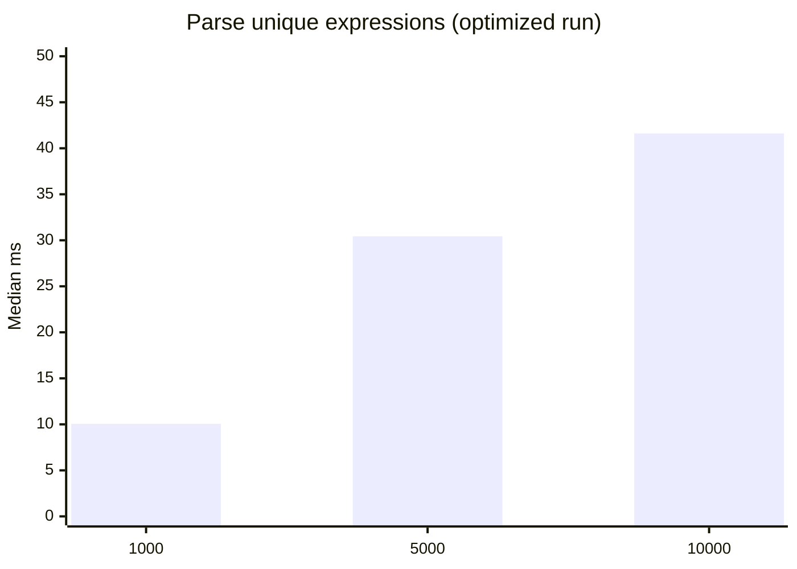
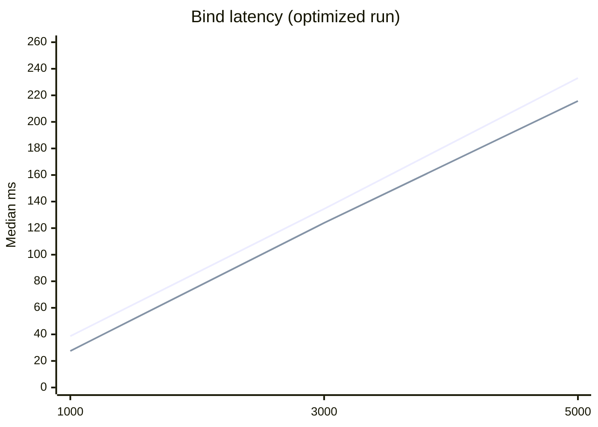
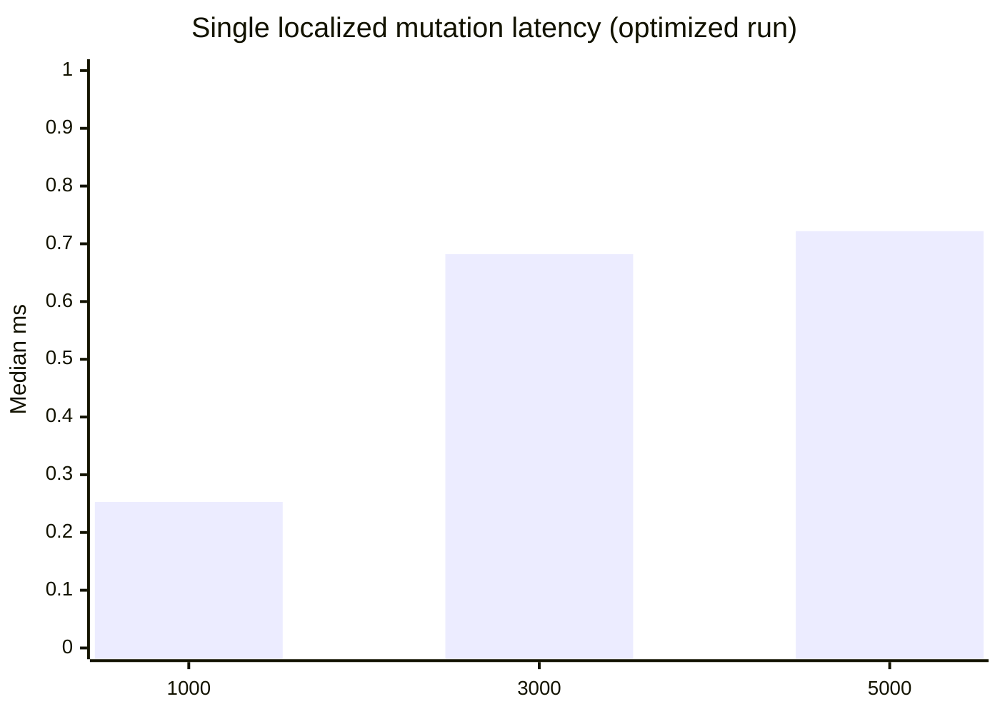
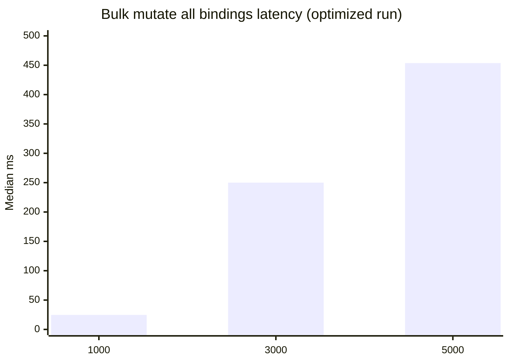
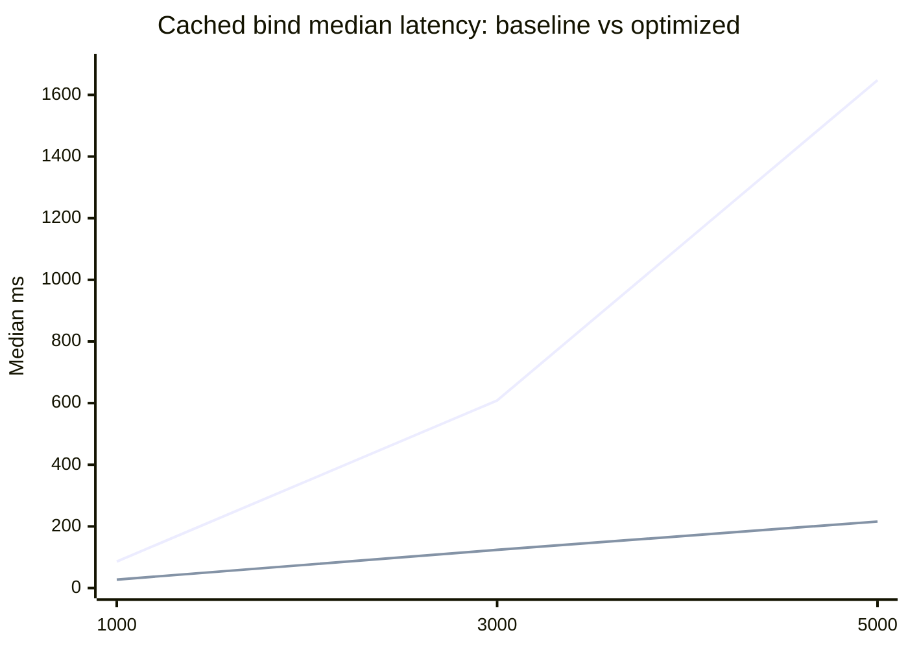
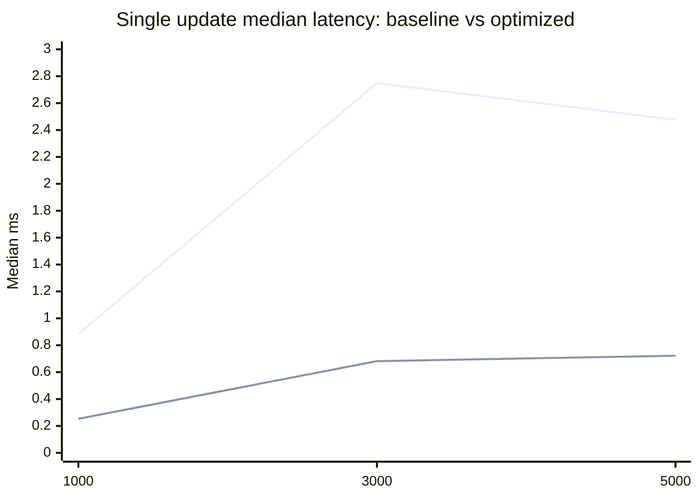
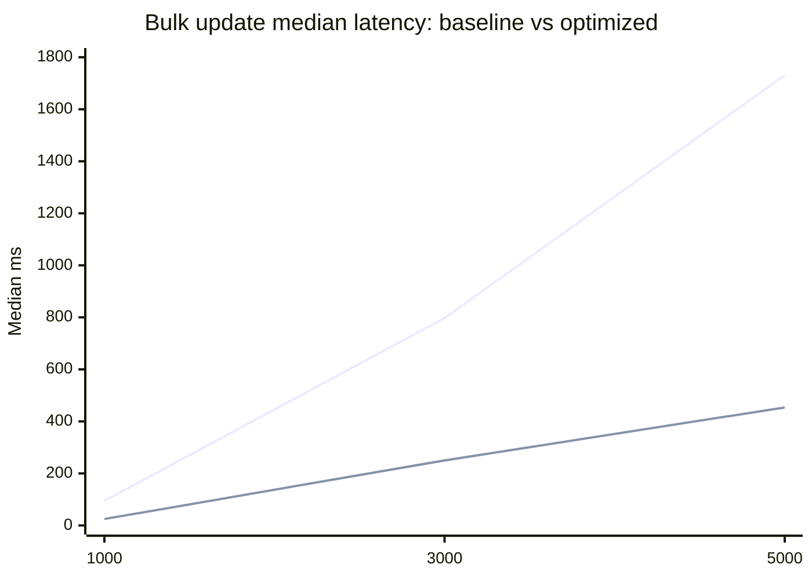

# RS-X SPA Performance Report

Date: 2026-03-14  
Package: `@rs-x/expression-parser`

## Goal

Validate whether rs-x is fast enough as a reactive core for a high-performance SPA framework integration (for example Angular-style UI composition).

## Optimization applied

### Change

Replaced per-`IndexValueObserver` global subscriptions with a keyed event router:

- Before: every observer subscribed directly to `stateManager.changed` and `stateManager.contextChanged`.
- After: one router subscription per state manager routes events by `(context, index)` to only relevant observers.

Implementation file:

- [identifier-expression.ts](/Users/robertsanders/projects/rs-x/rs-x-expression-parser/lib/expressions/identifier-expression.ts)

### Why this matters

The old model had O(N active observers) callback fan-out per emitted change.  
The new model reduces dispatch to O(listeners for changed key), which is usually near constant for localized updates.

## Benchmark code and data

- Benchmark runner:
  - [benchmark-spa-readiness.mjs](/Users/robertsanders/projects/rs-x/rs-x-expression-parser/scripts/benchmark-spa-readiness.mjs)
- Baseline data (before optimization):
  - [benchmark-2026-03-14-baseline.json](/Users/robertsanders/projects/rs-x/reports/rsx-spa-performance/benchmark-2026-03-14-baseline.json)
- Optimized data (after router optimization):
  - [benchmark-2026-03-14-optimized-router.json](/Users/robertsanders/projects/rs-x/reports/rsx-spa-performance/benchmark-2026-03-14-optimized-router.json)
- Latest benchmark output path (overwritten by reruns):
  - [benchmark-2026-03-14.json](/Users/robertsanders/projects/rs-x/reports/rsx-spa-performance/benchmark-2026-03-14.json)

Run command:

```bash
pnpm -C rs-x-expression-parser run bench:spa-readiness
```

## After optimization: key results

Environment: Node `v25.4.0`, `darwin`, `arm64`

### Parse (unique expressions)



| Parses | Median ms | p95 ms | Ops/s |
| --- | ---: | ---: | ---: |
| 1,000 | 10.057 | 10.615 | 99,432 |
| 5,000 | 30.439 | 33.518 | 164,262 |
| 10,000 | 41.613 | 45.707 | 240,311 |

### Bind (create + initial evaluate)



Legend:
- line 1: unique expression per binding
- line 2: cached expression string (`a + b`)

### Update latency with active bindings





| Active bindings | Single update median ms | Single update p95 ms | Bulk update median ms |
| --- | ---: | ---: | ---: |
| 1,000 | 0.253 | 0.444 | 24.709 |
| 3,000 | 0.682 | 1.710 | 250.014 |
| 5,000 | 0.722 | 1.525 | 453.666 |

## Before vs after (median ms)

### Cached bind throughput impact



### Single update latency impact



### Bulk update latency impact



| Metric | 1,000 | 3,000 | 5,000 |
| --- | ---: | ---: | ---: |
| Bind unique improvement | 57.2% | 79.7% | 87.3% |
| Bind cached improvement | 68.0% | 79.6% | 86.9% |
| Single update improvement | 71.4% | 75.2% | 70.9% |
| Bulk update improvement | 73.8% | 68.6% | 73.8% |

## Conclusion for SPA framework viability

Yes, rs-x is fast enough to serve as a high-performance SPA reactive core.

- Localized updates are now sub-millisecond to low-millisecond even with 3k–5k active bindings.
- Large bulk invalidations are still expensive by definition, but significantly improved.
- Parsing is not the dominant cost in this benchmark; change dispatch and bind setup were the main bottlenecks, and this optimization directly targets them.

